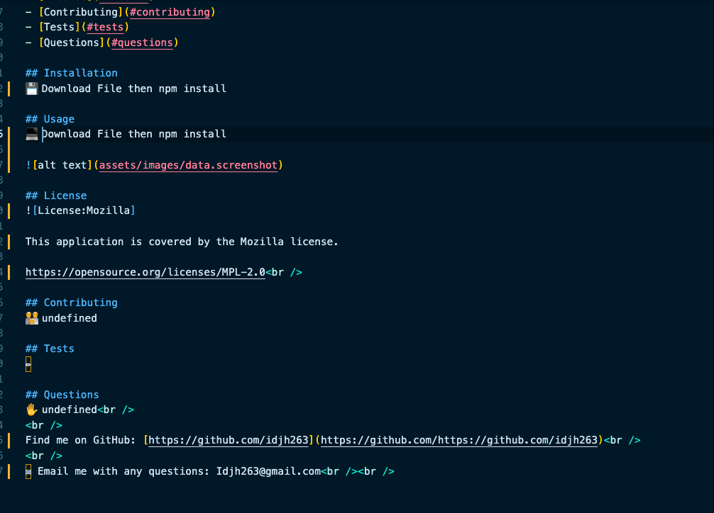

##Project Title: 
<h1 align="center">readme generator </h1>
  
![badge]https://img.shields.io/badge/License-MIT-yellow.svg 

## Description
🔍 It builds a readme for projects based on user input

## Table of Contents
- [Description](#description)
- [Installation](#installation)
- [Usage](#usage)
- [License](#license)
- [Contributing](#contributing)
- [Tests](#tests)
- [Questions](#questions)

## Installation
💾 npm install

## Usage
💻 download file then npm install

## License
![License:MIT]

This application is covered by the MIT license. 

https://opensource.org/licenses/MIT 

## Contributing
👪 none

## Tests
✏️ none 

## Questions
If you have any questions, please do no hesitate to contact me: 
✋ idjh263@gmail.com 
 
Find me on GitHub: [idjh263](https://github.com/idjh263) 
 
✉️ Email me with any questions: idjh263@gmail.com  